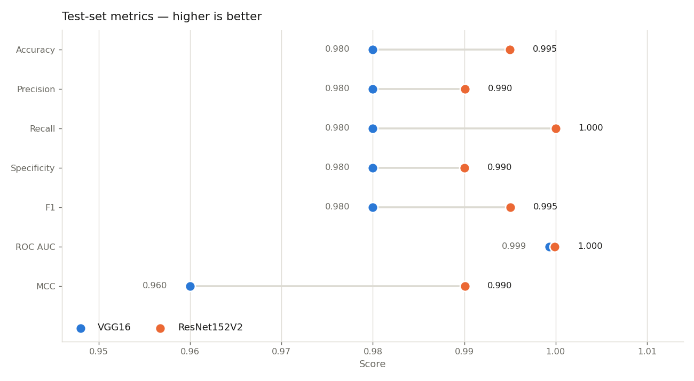
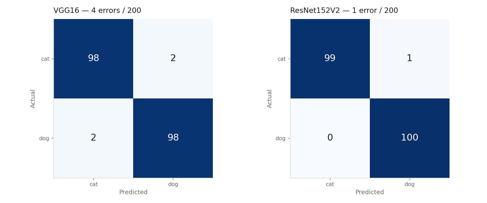
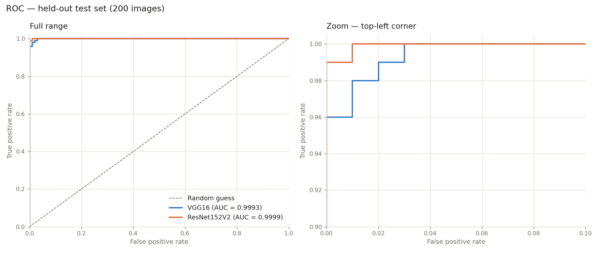
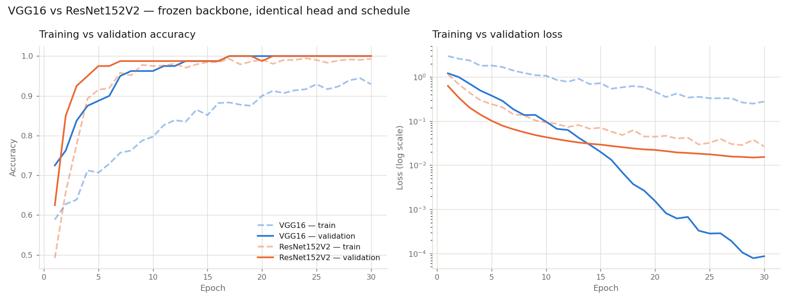

# 🐱🐶 Cat vs Dog Classification

My first image classification project — a binary image classifier built with **TensorFlow/Keras** that tells cats from dogs using **transfer learning**, and a head-to-head comparison of two frozen ImageNet backbones: **VGG16** and **ResNet152V2**.


---

## 📌 Overview

Instead of training a CNN from scratch on 800 images — which is far too little data — both models take a
convolutional base pre-trained on ImageNet, **freeze it**, and train only a small classification head on
top. The backbone acts as a fixed feature extractor; the head learns the cat/dog decision boundary in that
feature space.

The interesting question this repo answers is: **does the deeper, heavier backbone actually buy you
anything on a small dataset?** → [Jump to the comparison](#-vgg16-vs-resnet152v2)

## 📂 Dataset

- **Source:** [Dog vs Cat — Anthony Therrien (Kaggle)](https://www.kaggle.com/datasets/anthonytherrien/dog-vs-cat)

  ```python
  import kagglehub
  path = kagglehub.dataset_download("anthonytherrien/dog-vs-cat")
  print("Path to dataset files:", path)
  ```

| Split | Images | cat | dog | Where it comes from |
|-------|-------:|----:|----:|---------------------|
| Train | 720 | ~360 | ~360 | `data/train`, 90% of the folder |
| Validation | 80 | ~40 | ~40 | `data/train`, 10% carved out with the same seed |
| **Test** | **200** | **100** | **100** | `data/test` — never seen during training |

Perfectly balanced, so plain accuracy is a fair headline metric. Train and validation are carved out of the
same directory using `validation_split=0.1` with a **shared seed (42)** — that shared seed is what makes the
split disjoint, and the loader asserts on the file lists to catch any leakage.

## 🧠 Training process

Both backbones were trained through the **exact same pipeline**. Only two things differ: the frozen base,
and the `preprocess_input` that base expects. Everything else is held constant so the comparison measures
the backbone and nothing else.

```
data/train ──► image_dataset_from_directory (160×160, batch 32, seed 42)
                        │
                        ├── preprocess_input   VGG16: caffe BGR, mean-subtracted
                        │                      ResNet152V2: scaled to [-1, 1]
                        ├── cache → shuffle(1000) → prefetch
                        ▼
              RandomFlip(horizontal) + RandomRotation(0.1) + RandomZoom(0.1)   ← train only
                        ▼
              Frozen ImageNet backbone (training=False)
                        ▼
              GlobalAveragePooling2D → Dropout(0.3) → Dense(1, sigmoid)
                        ▼
              Adam(1e-4) + binary_crossentropy, 30 epochs
```

| Setting | Value |
|---------|-------|
| Image size | 160 × 160 × 3 |
| Batch size | 32 |
| Seed | 42 (`tf.keras.utils.set_random_seed`) |
| Epochs | 30 |
| Optimizer | Adam, lr = 1e-4 |
| Loss | Binary cross-entropy |
| Augmentation | Horizontal flip, ±10% rotation, ±10% zoom |
| Backbone | **Frozen** (`trainable = False`), ImageNet weights |
| Head | GAP → Dropout(0.3) → Dense(1, sigmoid) |
| Output | One sigmoid = P(dog); threshold 0.5 |
| Hardware | Single NVIDIA GPU (WSL2) |

Two details worth knowing, because getting either wrong silently ruins the results:

1. **Preprocessing must match the backbone.** VGG16 wants caffe-style BGR with the ImageNet mean subtracted;
   ResNetV2 wants inputs scaled to `[-1, 1]`. Feeding raw 0–255 RGB to either produces a model that trains
   to a plausible-looking accuracy and then collapses at inference.
2. **Augmentation runs on the training set only**, and the frozen base is called with `training=False` so its
   BatchNorm statistics stay at their ImageNet values rather than drifting on 720 images.

---

## 🔬 VGG16 vs ResNet152V2

Both models were trained back-to-back in a single run under the settings above — same seed, same split, same
head, same schedule. Every number below comes from
[`history and metric/backbone_comparison.json`](history%20and%20metric/backbone_comparison.json).

### The two backbones

| | VGG16 | ResNet152V2 |
|---|---|---|
| Architecture | 13 plain conv layers, stacked 3×3 | 152 layers with residual (skip) connections + pre-activation BN |
| Backbone layers | 19 | 564 |
| Total parameters | 14,715,201 | 58,333,697 |
| **Trainable parameters** | **513** | **2,049** |
| Feature map at 160×160 | 5 × 5 × 512 | 5 × 5 × 2048 |
| Weights on disk | ~56 MB | ~223 MB |
| Preprocessing | caffe BGR, mean-subtracted | scaled to [-1, 1] |

Only the final `Dense(1)` is trainable in each — 513 and 2,049 parameters respectively. The 4× difference in
trainable parameters is purely because ResNet's pooled feature vector is 2048-d instead of 512-d.

### 📊 Test-set results (200 held-out images)



| Metric | VGG16 | ResNet152V2 | Winner |
|--------|------:|------------:|--------|
| Accuracy | 0.980 | **0.995** | ResNet |
| Accuracy 95% CI (Wilson) | [0.950, 0.992] | [0.972, 0.999] | — |
| Precision | 0.980 | **0.990** | ResNet |
| Recall (dog) | 0.980 | **1.000** | ResNet |
| Specificity (cat) | 0.980 | **0.990** | ResNet |
| F1 score | 0.980 | **0.995** | ResNet |
| Matthews corr. coef. | 0.960 | **0.990** | ResNet |
| ROC AUC | 0.9993 | **0.9999** | ResNet |
| Test loss | 0.0533 | **0.0144** | ResNet |
| **Misclassified images** | **4 / 200** | **1 / 200** | ResNet |

ResNet152V2 wins on every single metric. Its one mistake is a cat scored as a dog; it caught all 100 dogs.



| | VGG16 | ResNet152V2 |
|---|---|---|
| True negatives (cat → cat) | 98 | 99 |
| False positives (cat → dog) | 2 | 1 |
| False negatives (dog → cat) | 2 | 0 |
| True positives (dog → dog) | 98 | 100 |



Both curves sit on top of the axis at full range, which is why the right panel zooms into the top-left
corner. ResNet reaches a 1.0 true-positive rate at a 1% false-positive rate; VGG16 needs 3%.

### 📈 Training behaviour



*Colour = backbone, dashed = training, solid = validation. Loss is on a log scale.*

Descriptive statistics across all 30 epochs:

| Series | Model | Mean | Std | Min | Max | Final |
|--------|-------|-----:|----:|----:|----:|------:|
| Training accuracy | VGG16 | 0.8325 | 0.1003 | 0.5889 | 0.9444 | 0.9292 |
| | ResNet152V2 | **0.9413** | 0.1108 | 0.4917 | 0.9944 | **0.9931** |
| Validation accuracy | VGG16 | 0.9575 | 0.0722 | 0.7250 | 1.0000 | 1.0000 |
| | ResNet152V2 | **0.9721** | 0.0721 | 0.6250 | 1.0000 | 1.0000 |
| Training loss | VGG16 | 0.9330 | 0.7406 | 0.2490 | 2.9701 | 0.2772 |
| | ResNet152V2 | **0.1494** | 0.2364 | 0.0267 | 1.1535 | **0.0267** |
| Validation loss | VGG16 | 0.1622 | 0.3054 | 0.0001 | 1.2087 | 0.0001 |
| | ResNet152V2 | **0.0722** | 0.1251 | 0.0150 | 0.6281 | 0.0154 |

Convergence speed — the epoch at which validation accuracy first reaches each level:

| Reaches | VGG16 | ResNet152V2 |
|---------|------:|------------:|
| ≥ 90% | epoch 7 | **epoch 3** |
| ≥ 95% | epoch 8 | **epoch 5** |
| 100% | epoch 17 | epoch 17 |
| Final train − val gap | −0.0708 | −0.0069 |

ResNet152V2 is roughly **twice as fast to converge** and finishes with a much tighter train/validation gap.
The gap being *negative* for both is expected, not a bug: augmentation and dropout are active during
training but disabled at validation time, so the training metric is measured on a harder version of the task.

### 🎯 Prediction confidence

Accuracy says how often a model is right; the probability distribution says how confidently.

| | VGG16 | ResNet152V2 |
|---|---|---|
| Mean P(dog) on cat images | 0.0160 ± 0.1126 | **0.0111 ± 0.0726** |
| Mean P(dog) on dog images | 0.9780 ± 0.1229 | **0.9887 ± 0.0387** |
| Separation margin | 0.9621 | **0.9776** |

ResNet is not just more accurate but more *decisive*: its standard deviations are ~3× smaller, meaning fewer
images land in the uncertain zone near 0.5. VGG16's wider spread is what produces its extra errors.

### ⚙️ Cost

| | VGG16 | ResNet152V2 | Ratio |
|---|---|---|---|
| Total training time (30 epochs) | **64 s** | 94 s | 1.5× |
| First epoch (graph build + cache) | **7.0 s** | 19.2 s | 2.7× |
| Steady-state epoch (median) | **1.95 s** | 2.56 s | 1.3× |
| Inference | **2.26 ms/img** | 3.00 ms/img | 1.3× |
| Parameters | **14.7 M** | 58.3 M | 4.0× |
| Weights on disk | **~56 MB** | ~223 MB | 4.0× |

### 🧾 What this actually means

1. **ResNet152V2 is the better model here** — 1 error vs 4, better on all seven metrics, lower test loss,
   faster convergence, more confident predictions.
2. **But the gap is not statistically proven.** With only 200 test images, the 95% confidence intervals
   ([0.950, 0.992] vs [0.972, 0.999]) overlap. A 3-image difference is within sampling noise. The honest
   statement is *"ResNet is consistently better across every metric"*, not *"ResNet is 1.5% more accurate."*
   Separating models this close would need a test set in the thousands.
3. **The validation set has stopped being useful.** Both models hit 100% validation accuracy by epoch 17 and
   stay there. VGG16's validation loss falls to 8.7 × 10⁻⁵ while its *test* loss is 0.053 — a 600× difference
   that says the 80-image validation set is too small and too easy, not that the model is near-perfect.
   Model selection or early stopping based on it would be unreliable.
4. **Depth helped, but transfer learning did the heavy lifting.** Both models clear 98% while training only
   513 / 2,049 parameters. On 800 images, the ImageNet features are doing nearly all of the work.
5. **Pick by constraint.** Accuracy-critical → ResNet152V2. Deployment-constrained (mobile, edge, cold-start
   latency, a 56 MB vs 223 MB download) → VGG16 gives up ~1.5 points of accuracy for a 4× smaller model.

### 🧪 Reproducibility

The VGG16 numbers reproduce exactly across runs and match the standalone
[`history and metric/metrics.json`](history%20and%20metric/metrics.json) produced by `src/train.py`
(accuracy 0.98, AUC 0.9993, identical 98/2/2/98 confusion matrix) — same seed, same data, same result.

---

## 📁 Project Structure

```
Cat-vs-Dog-classification/
│
├── data/                             # 800 train + 200 test images
│   ├── train/{cat,dog}/
│   └── test/{cat,dog}/
│
├── src/
│   ├── data_loader.py                # dataset config + loaders (shared)
│   ├── train.py                      # trains the VGG16 model and saves it
│   └── evaluate.py                   # scores a saved model on the test set
│
├── cat vs dog.ipynb                  # VGG16 pipeline, end to end
├── cat vs dog resnet.ipynb           # ResNet152V2 pipeline, end to end
│
├── models/
│   ├── cat_vs_dog_vgg16.keras        # final model (last epoch)
│   └── cat_vs_dog_vgg16_best.keras   # best epoch by val_accuracy
│
├── history and metric/
│   ├── history.json                  # per-epoch VGG16 training history
│   ├── metrics.json                  # VGG16 test metrics
│   └── backbone_comparison.json      # full VGG16 vs ResNet152V2 record
│
├── plots/
│   ├── comparison_training_curves.png
│   ├── comparison_metrics.png
│   ├── comparison_roc.png
│   ├── comparison_confusion.png
│   ├── training_curves.png
│   ├── evaluation_final.png / evaluation_best_val.png
│   └── roc_curve_final.png / roc_curve_best_val.png
│
├── README.md
└── LICENSE
```

## ⚙️ Installation

```bash
git clone https://github.com/<your-username>/Cat-vs-Dog-classification.git
cd Cat-vs-Dog-classification

python -m venv venv
source venv/bin/activate      # Windows: venv\Scripts\activate

pip install -r requirements.txt
```

### requirements.txt
```
tensorflow>=2.10
numpy
matplotlib
seaborn
pillow
scikit-learn
kagglehub
```

## 🚀 Usage

### Train the VGG16 model
```bash
python src/train.py
```
Writes `models/cat_vs_dog_vgg16.keras`, `models/cat_vs_dog_vgg16_best.keras` and the training history.
Training only touches `data/train` — the test set is never loaded here.

### Evaluate a saved model
```bash
python src/evaluate.py                                                       # final model
python src/evaluate.py --model models/cat_vs_dog_vgg16_best.keras --prefix best_val
python src/evaluate.py --data data/test --threshold 0.6
```

### Reproduce the ResNet152V2 run
Open `cat vs dog resnet.ipynb` and run all cells — it mirrors the VGG16 notebook with `ResNet152V2` and its
matching `preprocess_input`.

### Predict on a new image
```python
import numpy as np
import tensorflow as tf
from tensorflow.keras.applications.vgg16 import preprocess_input

model = tf.keras.models.load_model("models/cat_vs_dog_vgg16.keras")

img = tf.keras.utils.load_img("path/to/image.jpg", target_size=(160, 160))
x = preprocess_input(np.expand_dims(tf.keras.utils.img_to_array(img), axis=0))

p = float(model.predict(x)[0][0])          # single sigmoid = P(dog)
print(f"Dog 🐶 ({p:.2%})" if p >= 0.5 else f"Cat 🐱 ({1 - p:.2%})")
```

> Use the backbone's own `preprocess_input` — `vgg16` for the VGG models, `resnet_v2` for the ResNet one.
> Rescaling to `[0,1]` instead will produce confident nonsense.

## 🛠️ Technologies Used

- Python 3.10 · TensorFlow 2.20 / Keras
- NumPy · Matplotlib · Seaborn · scikit-learn
- Jupyter Notebook

## 🎯 Future Improvements

- [ ] Enlarge the test set — 200 images is too few to separate two models this close
- [ ] Fine-tune the top backbone blocks after the head converges (unfreeze + lr 1e-5)
- [ ] Add EfficientNetB0 / MobileNetV3 to the comparison for the accuracy-per-MB angle
- [ ] K-fold cross-validation instead of a single 80-image validation split
- [ ] Grad-CAM on the misclassified images to see what the models are actually looking at
- [ ] Deploy as a web app (Flask/Streamlit)

## 🤝 Contributing

Contributions, issues, and feature requests are welcome! Feel free to check the [issues page](../../issues).

## 📄 License

This project is licensed under the **MIT License** — see the [LICENSE](LICENSE) file for details.

## 🙋 Author

Built with curiosity as my first deep learning / computer vision project.

---

⭐ If you found this project helpful, consider giving it a star!
